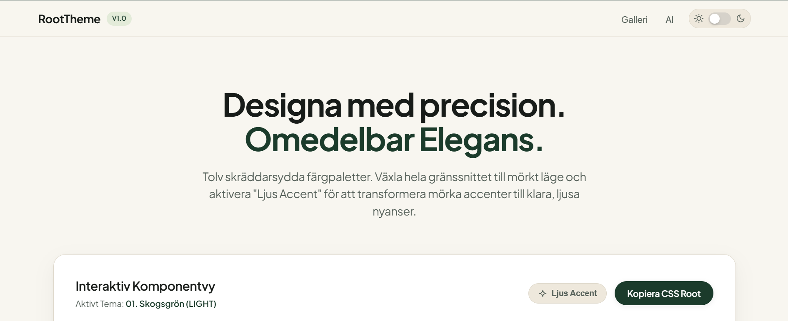
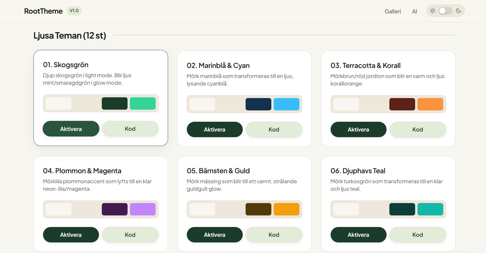
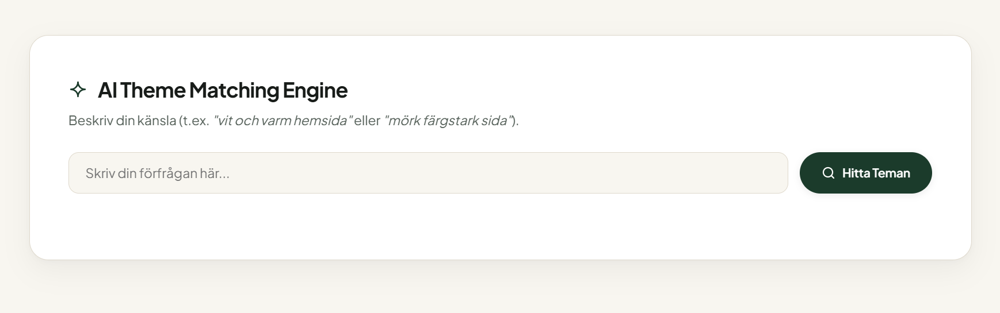

# RootTheme


RootTheme är en snabb, modern och interaktiv **CSS Variable Theme Engine** utvecklad för gränssnittsdesigners och utvecklare. Applikationen erbjuder färdiga färgpaletter, ett dynamiskt mörkt läge, "Ljus Accent"-teknik samt en inbyggd **AI Theme Matching Engine** som hjälper dig att hitta rätt färger baserat på textbeskrivningar.

[Besök hemsidan](https://meyerfoo20.github.io/RootTheme/)

---

## Om Projektet

RootTheme är utformat för att ge en omedelbar visuell förhandsgranskning av hur olika färgteman och variabler fungerar i ett komplett användargränssnitt. Du kan testa hur teman uppför sig på knappkomponenter, typografi och accenter samt kopiera färgkoden med ett klick.

Hemsidan är publicerad via GitHub Pages och kräver ingen installation eller krångliga beroenden för att köras.

---

## Funktioner


- **12 Skräddarsydda Teman:** Innehåller en rad noggrant balanserade färgpaletter (Skogsgrön, Marinblå, Terracotta, Plommon, Smaragd m.fl.).
- **Dynamiskt Mörkt Läge:** Växla sömlöst hela applikationens gränssnitt och färgset mellan ljusa och mörka teman.
- **Ljus Accent (Glow Mode):** Transformera dämpade accentfärger till klara och lysande nyanser för ökad kontrast och karaktär i mörkt läge.
- **AI Theme Matching Engine:** Skriv in vad du vill att din sida ska kännas som (t.ex. *"vit och varm hemsida"* eller *"mörk färgstark sida med havskänsla"*) så ställs temat och lägena in automatiskt.
- **Interaktiv Komponentvy:** Se direkt hur knappar, typografi och accenter svarar på dina valda färgvariabler.
- **Enkel Export:** Kopiera färdiga `:root`-variabler direkt till urklipp med ett klick för användning i egna projekt.
- **Zero Dependencies:** Byggd med ren **HTML5**, **CSS3** (CSS Variables) och **Vanilla JavaScript** (ES6+).

---

## Hur AI-matchningen fungerar


AI-motorn analyserar förfrågningar genom nyckelordsmatchning och regelbaserad logik:

1. **Lägesidentifiering:** Om sökningen innehåller ord som *"mörk"*, *"natt"* eller *"svart"* aktiveras Mörkt läge. Ord som *"vit"*, *"ljus"* eller *"dag"* växlar till Ljust läge.
2. **Accentidentifiering:** Ord som *"färgstark"*, *"neon"* eller *"lysande"* aktiverar Ljus Accent / Glow.
3. **Relevanspoäng:** Alla teman poängsätts baserat på namn, beskrivning och nyckelord. De 3 bästa träffarna visas, och det bästa alternativet aktiveras automatiskt.

---

## Använda genererade CSS-variabler i ditt eget projekt

Klicka på knappen **"Kopiera CSS Root"** i verktyget för att kopiera variablerna. Klistra sedan in dem i din egen CSS-fil:

```css
:root {
    --bg-main: #f8f6f0;
    --bg-alt: #eee8dc;
    --bg-card: #ffffff;
    --bg-glass: rgba(248, 246, 240, 0.82);
    --text-main: #181c19;
    --text-muted: #56615a;
    --border-color: #ded8cb;
    --shadow-elevated: 0 12px 32px rgba(0, 0, 0, 0.05), 0 2px 6px rgba(0, 0, 0, 0.02);
    --btn-text: #ffffff;
    --bg-footer: #152c20;
    --accent-main: #1b3b2b;
    --accent-hover: #29543e;
    --accent-light: #e3ebd9;
    --accent-pop: #34d399;
}
